# 📐 UML Diagramme - Mueller IT Backend

## 1. Klassendiagramm (Class Diagram)


---

## 2. Komponentendiagramm (Component Diagram)

```mermaid
graph TB
    subgraph "Frontend (React)"
        FE[React Application<br/>GitHub Pages]
    end

    subgraph "Backend (NestJS)"
        subgraph "API Gateway Layer"
            MAIN[Main.ts<br/>Entry Point]
            CORS[CORS Middleware]
            HELMET[Helmet Security]
            THROTTLE[Rate Limiter]
            SWAGGER[Swagger Docs]
        end

        subgraph "Application Modules"
            AUTH[AuthModule<br/>Authentication & JWT]
            USERS[UsersModule<br/>User Management]
            TICKETS[TicketsModule<br/>Ticket/Chat System]
            ADMIN[AdminModule<br/>Admin Functions]
        end

        subgraph "Cross-Cutting Concerns"
            GUARDS[Guards<br/>JwtAuthGuard, RolesGuard]
            DECORATORS[Decorators<br/>@CurrentUser, @Roles]
            PIPES[Validation Pipes<br/>DTO Validation]
        end

        subgraph "Database Layer"
            DB_MODULE[DatabaseModule<br/>Mongoose Connection]
        end
    end

    subgraph "External Services"
        MONGO[(MongoDB<br/>Local/Atlas)]
    end

    %% Connections
    FE -->|HTTP/REST + JWT| MAIN
    MAIN --> CORS
    MAIN --> HELMET
    MAIN --> THROTTLE
    MAIN --> SWAGGER

    CORS --> AUTH
    CORS --> TICKETS
    CORS --> ADMIN

    AUTH --> GUARDS
    TICKETS --> GUARDS
    ADMIN --> GUARDS

    GUARDS --> DECORATORS
    AUTH --> PIPES
    TICKETS --> PIPES

    AUTH --> USERS
    TICKETS --> DB_MODULE
    ADMIN --> TICKETS
    USERS --> DB_MODULE

    DB_MODULE -->|Mongoose| MONGO

    style FE fill:#61dafb,stroke:#000,stroke-width:2px
    style MONGO fill:#4db33d,stroke:#000,stroke-width:2px
    style AUTH fill:#e53935,stroke:#000,stroke-width:2px
    style ADMIN fill:#ffa726,stroke:#000,stroke-width:2px
```

---

## 3. Sequenzdiagramm - Authentication Flow


---

## 4. Sequenzdiagramm - Ticket Creation Flow

```mermaid
sequenceDiagram
    participant C as Client
    participant G as JwtAuthGuard
    participant TC as TicketsController
    participant TS as TicketsService
    participant DB as MongoDB

    C->>+G: POST /tickets<br/>Authorization: Bearer <JWT>
    G->>G: validate JWT
    G->>DB: findById(userId)
    DB-->>G: user found
    G->>TC: inject user to request
    TC->>+TS: createTicket(userId, createTicketDto)
    TS->>DB: create new Ticket<br/>{userId, title, status: 'open'}
    DB-->>TS: ticket saved
    TS->>DB: create initial Message<br/>{ticketId, senderId, content}
    DB-->>TS: message saved
    TS->>DB: populate ticket with messages
    DB-->>TS: ticket with messages
    TS-->>TC: ticket object
    TC-->>-C: 201 Created<br/>{ticket with messages}
```

---

## 5. Deployment Diagramm


---

## 6. Zustandsdiagramm - Ticket Status

```mermaid
stateDiagram-v2
    [*] --> open: Ticket erstellt

    open --> in_progress: Admin übernimmt
    open --> closed: User schließt

    in_progress --> waiting_for_user: Admin antwortet
    in_progress --> waiting_for_admin: User antwortet
    in_progress --> closed: Admin schließt

    waiting_for_user --> in_progress: User antwortet
    waiting_for_user --> closed: Timeout/Admin schließt

    waiting_for_admin --> in_progress: Admin antwortet
    waiting_for_admin --> closed: User schließt

    closed --> open: Wiederöffnen (Admin)
    closed --> [*]
```



---

## 7. Datenbank ER-Diagramm


---

## Legende

### Diagramm-Typen
- **Klassendiagramm**: Zeigt Klassen, Attribute, Methoden und Beziehungen
- **Komponentendiagramm**: Zeigt Module und ihre Abhängigkeiten
- **Sequenzdiagramm**: Zeigt zeitliche Abfolge von Interaktionen
- **Deployment Diagramm**: Zeigt physische Verteilung auf Server
- **Zustandsdiagramm**: Zeigt Zustandsübergänge
- **ER-Diagramm**: Zeigt Datenbank-Entitäten und Relationen

### Symbole
- `+` = public
- `-` = private
- `~` = protected
- `*` = multiplicity (many)
- `?` = optional
- `PK` = Primary Key
- `FK` = Foreign Key
- `UK` = Unique Key

---

**Hinweis:** Diese Diagramme können in GitHub/GitLab mit Mermaid-Support direkt gerendert werden.

**Tools zum Bearbeiten:**
- [Mermaid Live Editor](https://mermaid.live)
- VS Code Extension: "Markdown Preview Mermaid Support"
- Draw.io für detailliertere UML-Diagramme
